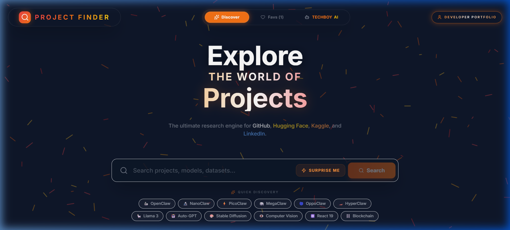
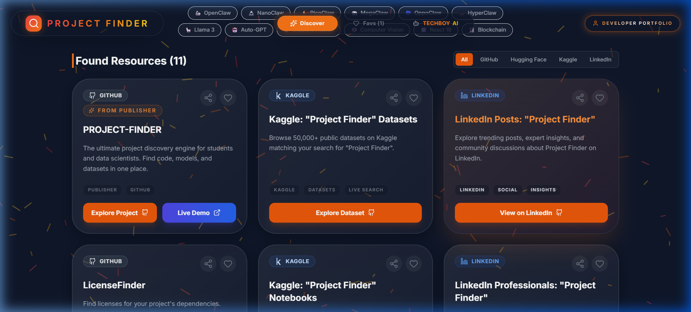
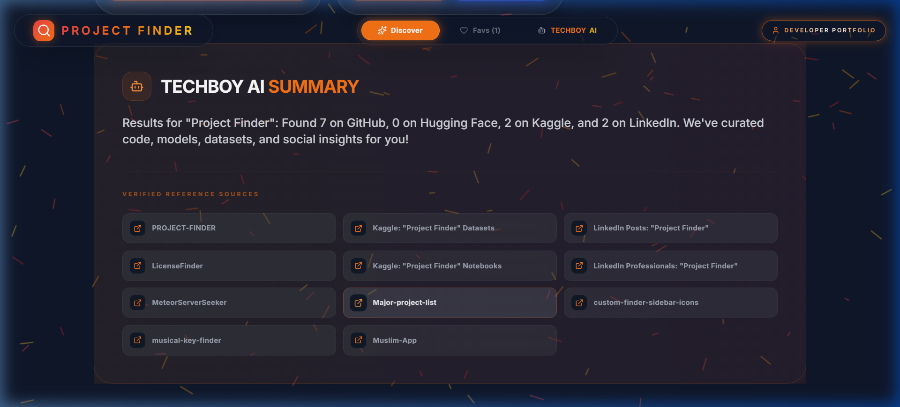

# Project Finder 🚀

<div align="center">
  
  
  
  
</div>

**Project Finder** is an advanced research & discovery engine designed for developers, data scientists, and students. It provides a high-fidelity, unified search experience across the world's most critical innovation hubs.

## 🌟 Detailed Platform Breakdown

### 🐙 GitHub Innovation Portal
- **Advanced Repository Discovery**: Search millions of public repositories with intelligent sorting by stars and relevance.
- **Profile README Synchronization**: A specialized real-time engine that discovers and showcases creative, elite GitHub Profile READMEs for industrial inspiration.
- **Instant Access Protocol**: Direct one-click navigation to source code, documentation, and live deployments.

### 🤗 Hugging Face Hub (AI & ML)
- **Model Intelligence**: Discover state-of-the-art machine learning models across various pipeline tags (NLP, Vision, Audio).
- **Interactive Spaces**: Directly locate hosted AI demos and interactive web applications (Gradio/Streamlit) on the Hugging Face ecosystem.
- **Research Assets**: Access datasets and metadata critical for AI development.

### 📊 Kaggle Data Engine
- **Global Datasets**: Seamlessly search through Kaggle's vast library of public datasets for machine learning competitions and personal research.
- **Notebook & Insights**: Locate high-impact Python/R notebooks and analytical tutorials matching your query.

### 💼 LinkedIn Professional Insights
- **Expert Networking**: Connect with professionals and lead developers specialized in specific technologies.
- **Trending Knowledge**: Retrieve social insights, expert posts, and trending community discussions about your search topics directly from LinkedIn.

---

## 🌐 Live Demo
👉 **[Open Project Finder - Live Demo](https://chimataraghuram.github.io/PROJECT-FINDER/)**

## 📸 Preview
Experience the high-fidelity interface of Project Finder v2.0:

### 1. Modern Unified Search
The homepage features an **Animated AI Blueprint** background with parallax scrolling, drift animations, and interactive click-pulses.
<p align="center">
  
</p>

### 2. Search Results & Action Protocol
Enhanced project cards now include a primary **Live Demo** button for instant interaction, alongside scroll-reveal animations.
<p align="center">
  
</p>

### 3. Rebranded TECHBOY AI Summary
The analytical engine has been completely rebranded with an orange "Elite" theme, integrating consolidated reference sources directly into the summary.
<p align="center">
  
</p>

---

## ✨ Core Features
🔹 **Unified Platform Discovery**: Search GitHub, Hugging Face, Kaggle, and LinkedIn simultaneously.  
🔹 **Smart Filtering**: Drill down specifically into Code, Models, or Datasets with intuitive tags.  
🔹 **Visual Library (Favorites)**: Click the heart icon on any card to save it to your local persistent library.  
🔹 **README Discovery**: Explore and sync with elite GitHub Profile README inspirations in real-time.  
🔹 **Interactive UI/UX**: Built with Framer Motion for smooth animations and a premium glassmorphism feel.  

## 🧠 Problem It Solves
Developers often struggle with "platform fragmentation"—the need to jump between multiple sites to find the right code, data, and models. This disjointed process wastes time and hinders cross-platform research.

## 💡 Solution
Project Finder centralizes the entire discovery phase. By aggregating top-tier resources into a single dashboard, it provides a holistic view of the innovation landscape, enabling faster and more efficient project architecting.

## 🛠️ Tech Stack
- **Frontend**: `React 19`, `TypeScript`, `Tailwind CSS`, `Framer Motion`
- **Backend & Auth**: `Firebase` (Authentication & Cloud Firestore)
- **Architecture**: Component-based modular design
- **Deployment**: `GitHub Pages` / `Vite`

## 📂 Project Structure
```text
PROJECT-FINDER/
├── public/                 # High-res assets (Hero images, intro video)
├── src/                    
│   ├── components/         # Modular UI (SearchBar, ProjectCard, Particles, etc.)
│   ├── services/           # API Handlers for GitHub, HF, Kaggle
│   ├── types.ts            # Centralized Type Definitions
│   ├── services/           # Firebase configuration and auth logic
│   ├── App.tsx             # Application Core & State Management
│   └── index.css           # Global Tailwind and Aurora Styles
└── README.md               # You are here!
```

## 🚀 Getting Started with Cloud Features
To enable **Cloud Sync** and **Authentication** locally:
1.  **Install Dependencies**: `npm install firebase`
2.  **Firebase Setup**: Create a project at [Firebase Console](https://console.firebase.google.com/), enable Google Auth and Firestore.
3.  **Config**: Apply your keys to `src/services/firebase.ts`.

## 🚀 Future Improvements
🔸 **Multi-Social Integration**: Adding support for StackOverflow and Reddit insights.  
🔸 **AI Recommendations**: Implementing behavior-based discovery engines.  
🔸 **Mobile Performance**: Optimizing for extreme low-latency on mobile devices.  

## 🤝 Contributing
Pull requests are welcome! Feel free to fork and improve.

## 📜 License & Copyright
> [!IMPORTANT]
> **Copyright (c) 2026 Chimata Raghuram. All Rights Reserved.**
> 
> COMMERCIAL AND PERSONAL USE OF THIS SOFTWARE, CONTENT, OR SOURCE CODE IS STRICTLY PROHIBITED WITHOUT THE PRIOR WRITTEN CONSENT OF THE OWNER (CHIMATA RAGHURAM).
> 
> Any unauthorized copying, modification, distribution, transmission, or other use of this material is strictly prohibited. The developer (Chimata Raghuram) reserves all rights to this software and its intellectual property.

## 📬 Contact
GitHub: [chimataraghuram](https://github.com/chimataraghuram)  
LinkedIn: [Chimata Raghuram](https://linkedin.com/in/chimataraghuram)
