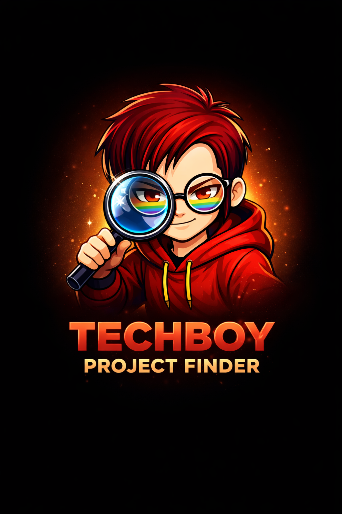
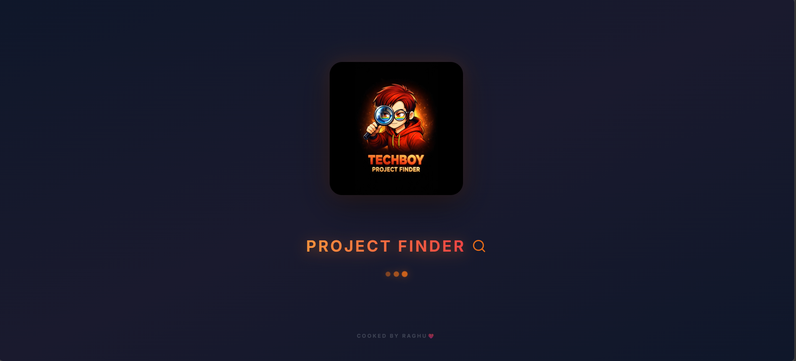

<div align="center">



<h1 style="color: #ffffff; font-weight: 900; letter-spacing: -2px; margin-bottom: 5px; font-size: 3rem;">
PROJECT FINDER
</h1>

<p style="color: #f97316; font-weight: 700; letter-spacing: 4px; text-transform: uppercase; font-size: 0.9rem; margin-bottom: 20px; opacity: 0.8;">
The Ultimate Research & Discovery Engine 🚀
</p>

<div style="display: flex; justify-content: center; gap: 12px; margin-bottom: 30px;">
  <a href="https://chimataraghuram.github.io/PROJECT-FINDER/">
    
  </a>
  <a href="https://github.com/chimataraghuram/PROJECT-FINDER">
    
  </a>
  <a href="https://chimataraghuram.github.io/PROJECT-FINDER/#profiles">
    
  </a>
</div>

[](https://git.io/typing-svg)

<p align="center" style="max-width: 800px; margin: 0 auto; line-height: 1.8; color: #cbd5e1; font-size: 1.05rem;">
  <strong>Project Finder</strong> is a premium research workspace for developers and students. It combines GitHub-first discovery, live trending repositories, multi-platform resources, RAG-powered TECHBOY AI, saved collections, and persistent research history in one focused interface.
</p>

<div style="display: flex; justify-content: center; gap: 20px; flex-wrap: wrap; margin-top: 30px;">
  
  
  
  
  
  
</div>

</div>

<br/>

---

## 🌐 Live Demo

👉 [Explore Project Finder](https://chimataraghuram.github.io/PROJECT-FINDER/)

* Helping developers quickly discover meaningful projects to learn, build, and contribute.

---

## 📸 PROJECT SCREENSHOTS

<div align="center">

### 1. Premium Splash Screen
*Elegant onboarding with the mascot logo and motion-ready branding.*


### 2. Hero Section & Main Search
*The clean and powerful landing page designed for ultimate project discovery.*


### 3. Dynamic Sticky Navigation
*A sleek glassmorphic navigation bar that intelligently adapts as you scroll.*


### 4. Advanced Search & Filtering
*Comprehensive search results with robust filtering by platform, language, and activity.*


### 5. Trending Ecosystem Feeds
*Live feeds showcasing the hottest repositories across GitHub and other major platforms.*


### 6. Real-Time Project Leaderboards
*Beautifully ranked project cards featuring live metadata, tech stacks, and quick-action links.*


### 7. Your Personalized Library
*A dedicated workspace to organize, manage, and revisit your saved project inspirations.*


### 8. Seamless Collection Browsing
*A smooth, continuous scrolling experience through your curated project lists.*


### 9. TECHBOY AI Assistant
*An integrated, context-aware AI partner ready to analyze any project repository.*


### 10. Intelligent AI Conversations
*Ask deep technical questions about architecture, code, and tech stacks in real-time.*


### 11. User Profile & Integrations
*A secure dashboard to manage your account, connect GitHub, and export your research data.*


### 12. Platform Documentation & Footer
*Comprehensive usage guides and developer portfolio integration for complete transparency.*


</div>

---

<br/>

## 🔍 Unified Discovery Engine

<p style="color: #64748b; font-size: 1.05rem; margin-bottom: 30px;">
Project Finder features a <strong>platform-aware Discovery Engine</strong> with intelligent category-weighted searching across the entire developer ecosystem:
</p>

<table width="100%" style="border-collapse: collapse; border: none; margin-bottom: 40px;">
  <tr>
    <td width="50%" style="padding: 10px; border: none;">
      <div style="background: rgba(255,255,255,0.03); border: 1px solid rgba(255,255,255,0.1); border-radius: 20px; padding: 25px; transition: 0.3s; height: 160px;">
        <h3 style="color: #ffffff; margin-top: 0; display: flex; align-items: center; gap: 10px;">
           GitHub
        </h3>
        <p style="color: #94a3b8; font-size: 0.9rem; line-height: 1.6;">
          Real-time trending, searchable, filterable repository discovery with GitHub results prioritized first.
        </p>
      </div>
    </td>
    <td width="50%" style="padding: 10px; border: none;">
      <div style="background: rgba(255,255,255,0.03); border: 1px solid rgba(255,255,255,0.1); border-radius: 20px; padding: 25px; transition: 0.3s; height: 160px;">
        <h3 style="color: #ffffff; margin-top: 0; display: flex; align-items: center; gap: 10px;">
          <span style="font-size: 20px;">🤗</span> Hugging Face
        </h3>
        <p style="color: #94a3b8; font-size: 0.9rem; line-height: 1.6;">
          AI model discovery with direct model links and platform-aware project cards.
        </p>
      </div>
    </td>
  </tr>
  <tr>
    <td width="50%" style="padding: 10px; border: none;">
      <div style="background: rgba(255,255,255,0.03); border: 1px solid rgba(255,255,255,0.1); border-radius: 20px; padding: 25px; transition: 0.3s; height: 160px;">
        <h3 style="color: #ffffff; margin-top: 0; display: flex; align-items: center; gap: 10px;">
           Kaggle
        </h3>
        <p style="color: #94a3b8; font-size: 0.9rem; line-height: 1.6;">
          Dataset discovery with direct dataset links and unified cross-platform results.
        </p>
      </div>
    </td>
    <td width="50%" style="padding: 10px; border: none;">
      <div style="background: rgba(255,255,255,0.03); border: 1px solid rgba(255,255,255,0.1); border-radius: 20px; padding: 25px; transition: 0.3s; height: 160px;">
        <h3 style="color: #ffffff; margin-top: 0; display: flex; align-items: center; gap: 10px;">
           LinkedIn
        </h3>
        <p style="color: #94a3b8; font-size: 0.9rem; line-height: 1.6;">
          Professional discovery links presented alongside technical project resources.
        </p>
      </div>
    </td>
  </tr>
</table>

<br/>

## 🧠 Intelligent Search Experience

<div style="background: linear-gradient(135deg, rgba(249,115,22,0.1) 0%, rgba(0,0,0,0) 100%); border-left: 4px solid #f97316; padding: 30px; border-radius: 0 20px 20px 0; margin-bottom: 40px;">
  <div style="margin-bottom: 25px;">
    <h4 style="color: #f97316; text-transform: uppercase; letter-spacing: 2px; font-size: 11px; margin-bottom: 8px;">Protocol 01</h4>
    <h3 style="color: #ffffff; margin: 0 0 12px 0; font-size: 1.4rem;">Explicit Intent Triggering</h3>
    <p style="color: #94a3b8; font-size: 0.95rem; line-height: 1.7; margin: 0;">
      Search logic is optimized for <strong>user intent</strong>—preventing automatic triggering while typing and allowing for precise controls via "Enter", the "Explore" button, or platform/category filters.
    </p>
  </div>
  <div>
    <h4 style="color: #f97316; text-transform: uppercase; letter-spacing: 2px; font-size: 11px; margin-bottom: 8px;">Protocol 02</h4>
    <h3 style="color: #ffffff; margin: 0 0 12px 0; font-size: 1.4rem;">Contextual Discovery</h3>
    <p style="color: #94a3b8; font-size: 0.95rem; line-height: 1.7; margin: 0;">
      The search engine correctly handles category transitions, ensuring that filters like <strong>AI/ML</strong> or <strong>Web Dev</strong> update existing search results instantly with zero latency.
    </p>
  </div>
</div>

---

## ✨ Features

- 🤖 **TECHBOY AI + RAG**: Retrieval-Augmented Generation using repository ingestion, code/document chunk retrieval, grounded answers, source citations, Quick and Deep Research modes, streaming, formatting, copy, regenerate, feedback, and session restore.
- 👑 **Platform Profiles**: Professional platform-native cards with brand identity for GitHub, HF, Kaggle, and LinkedIn.
- 📊 **Comparison Studio**: Side-by-side comparison of multiple repositories to evaluate complexity and tech stack.
- 🌍 **Multi-Platform**: Discover projects, models, and datasets across GitHub, HF, Kaggle, and LinkedIn in one view.
- ☁️ **Google Authentication**: Firebase Google Sign-In with persistent sessions and UID-based user data.
- 🗂️ **Saved Collections**: Create named square collections, assign starred projects, open collections, rename, delete, and remove projects.
- 🕘 **Research History**: Combined searchable history with internal scrolling and saved research conversations.
- 🔎 **Search Filters**: GitHub-first results with platform, language, minimum stars, date, and sort filters.
- 🔔 **GitHub Updates**: Detects changed stars and repository activity for saved GitHub projects.
- 📴 **Resilient Discovery**: Local caching and GitHub fallback behavior when Render or public APIs are unavailable.
- 📱 **High-Density UI**: Premium glassmorphic interface with mobile-first optimizations for desktop-class research.
- 🚀 **Live API Proxy**: Proxied requests for high-frequency, authentic discovery with zero-loop reliability.
- 🎥 **Intro Experience**: Premium video onboarding and smooth Framer Motion transitions.

---

## 🛠️ Tech Stack

- **Frontend**: [React v19](https://reactjs.org/), [Vite](https://vitejs.dev/), [Framer Motion](https://www.framer.com/motion/), [Lucide React](https://lucide.dev/)
- **Backend**: [Node.js](https://nodejs.org/) (Express) with [Mongoose](https://mongoosejs.com/)
- **AI Integration**: [OpenRouter API](https://openrouter.ai/) & [Google Gemini AI](https://ai.google.dev/)
- **RAG Pipeline**: Repository ingestion, document/code chunking, semantic retrieval, context-grounded generation, and citation sources
- **Database**: [MongoDB Atlas](https://www.mongodb.com/atlas)
- **Authentication**: [Firebase Authentication](https://firebase.google.com/docs/auth) with Google Sign-In and server-side token verification
- **Hosting**: [Render](https://render.com/) (Backend) & [GitHub Pages](https://pages.github.com/) (Frontend)

### Local Setup

```bash
git clone https://github.com/chimataraghuram/PROJECT-FINDER.git
cd PROJECT-FINDER/frontend
npm install
npm run dev
```

The frontend runs on Vite. Start the backend separately from `backend` with `npm install` and `npm start`. Copy the environment examples into local `.env` files and keep server secrets, service-account credentials, and API keys out of frontend code.

### Configuration

Frontend Firebase web settings use the `VITE_FIREBASE_*` variables documented in `frontend/.env.example`. Backend configuration uses `MONGODB_URI`, `FIREBASE_SERVICE_ACCOUNT_JSON`, `GITHUB_TOKEN`, `OPENROUTER_API_KEY`, `RAG_MODEL`, and `FRONTEND_ORIGINS` where required.

Google Sign-In is the application authentication flow. Firebase creates accounts on first successful login, restores sessions, and provides the identity used to associate saved projects, collections, searches, and research sessions.

---

## 📁 Project Structure

```text
📁 PROJECT-FINDER
│
├── 📁 frontend              # React/TypeScript Application (Vite)
│   ├── 📁 components        # Glassmorphic UI & AI Assistant components
│   ├── 📁 services          # API integration (GitHub, HF, Kaggle, OpenRouter)
│   ├── 📁 src/assets        # Organized media (Logos, Screenshots, Videos)
│   ├── App.tsx             # Core application logic & routing
│   └── index.tsx           # Entry point
│
├── 📁 backend               # Node.js/Express API (Render)
│   ├── 📁 controllers       # AI (OpenRouter), Auth, and Project logic
│   ├── 📁 models            # Mongoose schemas (User, Projects)
│   ├── 📁 routes            # Express API routes
│   └── server.js            # API entry point
│
└── README.md                # Comprehensive documentation
```

---

## 🚀 Future Roadmap

- [x] **AI Recommendations**: Personalized project suggestions based on your saved favorites.
- [x] **Research Workspace**: Saved, restored, renamed, deleted, and exportable research sessions.
- [x] **Collection Management**: Named collections with project assignment and removal.
- [ ] **Admin Monitoring**: Role-protected operational metrics and error monitoring dashboard.
- [ ] **Community Portals**: Share and review project discoveries with other developers.

---

## 🤝 Contributing

We love contributions! Help make **Project Finder** even better by following these simple steps:

- 🍴 **Fork** the repository to your own account.
- 🌿 **Create** a new branch for your feature (`git checkout -b feature/amazing-feature`).
- 🛠️ **Commit** your changes with descriptive messages.
- 🚀 **Push** to your branch (`git push origin feature/amazing-feature`).
- 📥 **Open** a Pull Request and describe your improvements.

---

## 📄 License

This project is licensed under the **MIT License**.

> [!IMPORTANT]
> You are free to use, modify, and contribute to this project. However, **proper attribution must be given to the original author**. This project is created for learning and development purposes—do not claim this work as your own.

---

## 🧑‍💻 Author
<hr>

**CHIMATA RAGHURAM (TECHBOY)** _Full-Stack Developer & AI Enthusiast_

<br>

<div style="display: flex; gap: 10px; margin-bottom: 20px;">
  <a href="https://chimataraghuram.vercel.app/">
    
  </a>
  <a href="https://www.linkedin.com/in/chimataraghuram/">
    
  </a>
  <a href="https://github.com/chimataraghuram">
    
  </a>
</div>

<hr>
<br>

<div align="center">
  COOKED BY RAGHU ❤️
</div>
