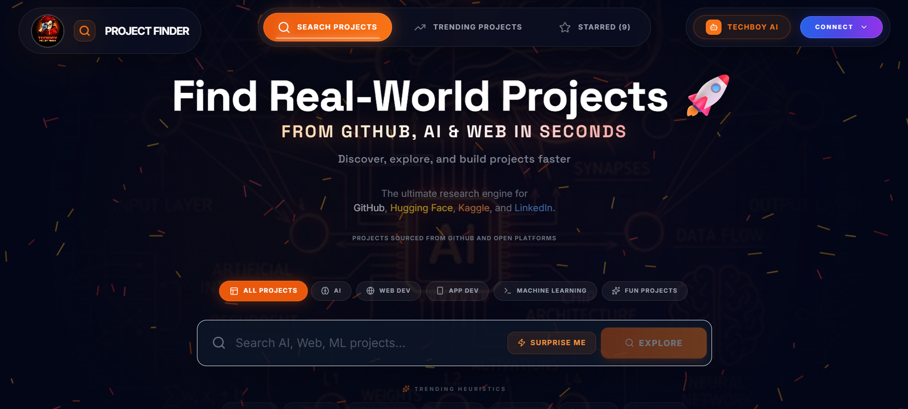
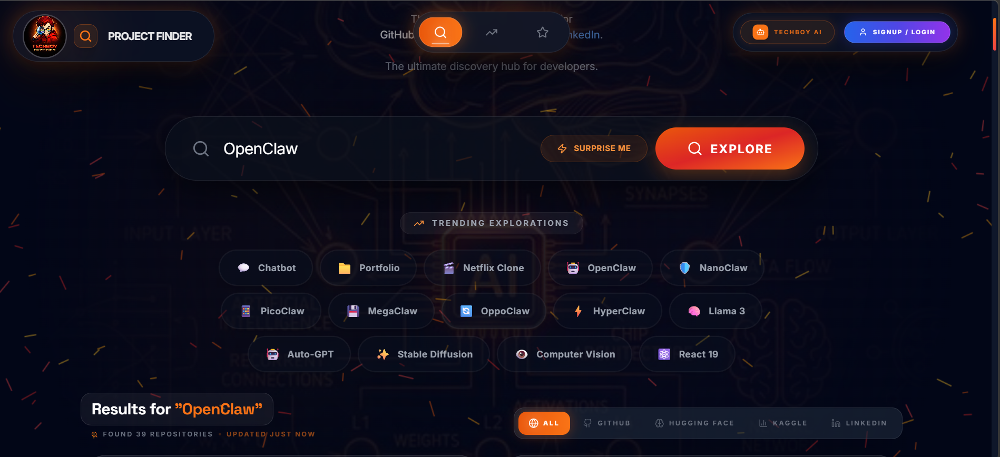
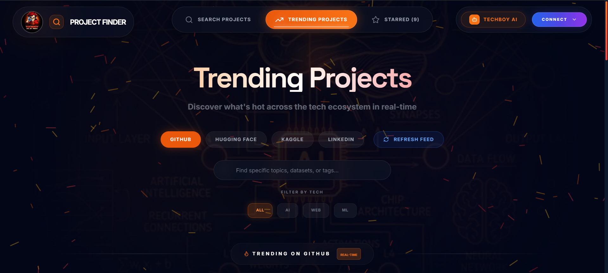
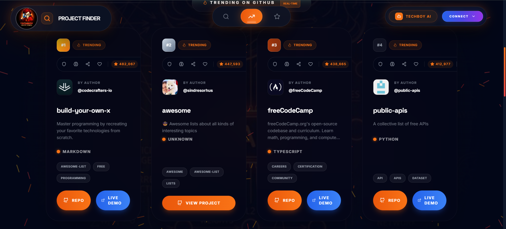
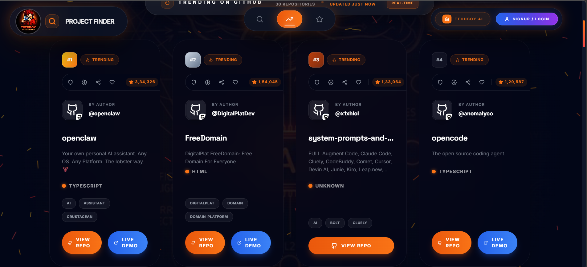
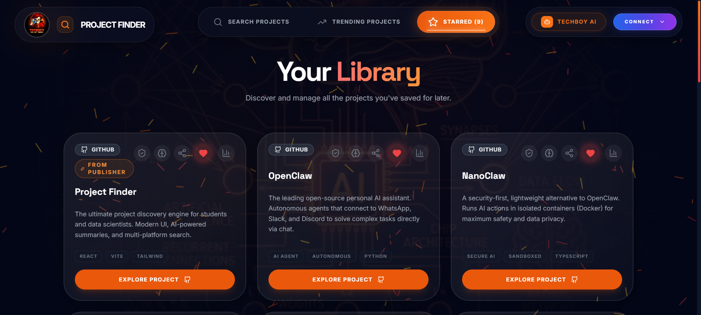
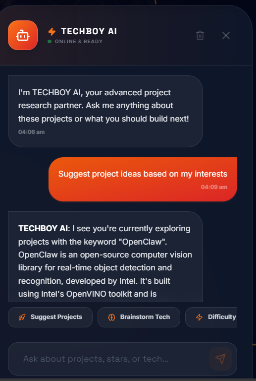
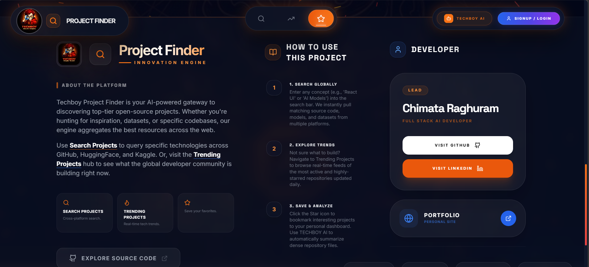

<div align="center">


<h1 style="color: #ffffff; font-weight: 900; letter-spacing: -2px; margin-bottom: 5px; font-size: 3rem;">
PROJECT FINDER
</h1>

<p style="color: #f97316; font-weight: 700; letter-spacing: 4px; text-transform: uppercase; font-size: 0.9rem; margin-bottom: 20px; opacity: 0.8;">
The Ultimate Research & Discovery Engine 🚀
</p>

<div style="display: flex; justify-content: center; gap: 12px; margin-bottom: 30px;">
  <a href="https://chimataraghuram.github.io/PROJECT-FINDER/">
    
  </a>
  <a href="https://github.com/chimataraghuram/PROJECT-FINDER">
    
  </a>
  <a href="https://chimataraghuram.github.io/PROJECT-FINDER/#profiles">
    
  </a>
</div>

[](https://git.io/typing-svg)

<p align="center" style="max-width: 800px; margin: 0 auto; line-height: 1.8; color: #cbd5e1; font-size: 1.05rem;">
  <strong>Project Finder</strong> is a premium, high-density research engine designed to help developers and students discover real-world open source projects in seconds. Powered by the GitHub V3 API and integrated with <strong>TECHBOY AI</strong>, the platform provides a unified interface to explore trending repositories, AI models, and technical datasets across the global developer ecosystem.
</p>

<div style="display: flex; justify-content: center; gap: 20px; flex-wrap: wrap; margin-top: 30px;">
  
  
  
  
  
  
</div>

</div>

<br/>

---

## 🌐 Live Demo

👉 [Explore Project Finder](https://chimataraghuram.github.io/PROJECT-FINDER/)

* Helping developers quickly discover meaningful projects to learn, build, and contribute.

---

## 🖼️ PROJECT SCREENSHOTS

<div align="center">

### 1. Premium Splash Screen
*Elegant onboarding with the mascot logo and motion-ready branding.*


### 2. Intelligent Hero & Discovery
*The central search hub with quick-exploration categories and multi-platform support.*


### 3. Context-Aware Search Bar
*Dynamic search interface that suggests trending explorations for instant discovery.*


### 4. High-Density Project Cards
*Premium project displays featuring live stats, tech stacks, and quick-action buttons.*


### 5. Global Trending Engine
*Dedicated hub for discovering hot repositories and models across all major platforms.*


### 6. Ranked Project Leaderboard
*Real-time trending dashboard for the most active projects in the developer ecosystem.*


### 7. User Dashboard & Starred Collections
*Organized workspace for managing your saved project inspirations and syncing with the cloud.*


### 8. TECHBOY AI Chatbot
*Intelligent assistant providing technical guidance and project recommendations in real-time.*


### 9. Usage Guide & Developer Profile
*Detailed documentation and integrated developer profile for complete transparency.*


</div>

---

<br/>

## 🔍 Unified Discovery Engine

<p style="color: #64748b; font-size: 1.05rem; margin-bottom: 30px;">
Project Finder features a <strong>platform-aware Discovery Engine</strong> with intelligent category-weighted searching across the entire developer ecosystem:
</p>

<table width="100%" style="border-collapse: collapse; border: none; margin-bottom: 40px;">
  <tr>
    <td width="50%" style="padding: 10px; border: none;">
      <div style="background: rgba(255,255,255,0.03); border: 1px solid rgba(255,255,255,0.1); border-radius: 20px; padding: 25px; transition: 0.3s; height: 160px;">
        <h3 style="color: #ffffff; margin-top: 0; display: flex; align-items: center; gap: 10px;">
           GitHub
        </h3>
        <p style="color: #94a3b8; font-size: 0.9rem; line-height: 1.6;">
          Real-time trending and star-filtered repository discovery across million of sources.
        </p>
      </div>
    </td>
    <td width="50%" style="padding: 10px; border: none;">
      <div style="background: rgba(255,255,255,0.03); border: 1px solid rgba(255,255,255,0.1); border-radius: 20px; padding: 25px; transition: 0.3s; height: 160px;">
        <h3 style="color: #ffffff; margin-top: 0; display: flex; align-items: center; gap: 10px;">
          <span style="font-size: 20px;">🤗</span> Hugging Face
        </h3>
        <p style="color: #94a3b8; font-size: 0.9rem; line-height: 1.6;">
          Native AI model discovery with high-density "View Model" interactive profiles.
        </p>
      </div>
    </td>
  </tr>
  <tr>
    <td width="50%" style="padding: 10px; border: none;">
      <div style="background: rgba(255,255,255,0.03); border: 1px solid rgba(255,255,255,0.1); border-radius: 20px; padding: 25px; transition: 0.3s; height: 160px;">
        <h3 style="color: #ffffff; margin-top: 0; display: flex; align-items: center; gap: 10px;">
           Kaggle
        </h3>
        <p style="color: #94a3b8; font-size: 0.9rem; line-height: 1.6;">
          High-impact dataset discovery with native "View Dataset" optimized profile views.
        </p>
      </div>
    </td>
    <td width="50%" style="padding: 10px; border: none;">
      <div style="background: rgba(255,255,255,0.03); border: 1px solid rgba(255,255,255,0.1); border-radius: 20px; padding: 25px; transition: 0.3s; height: 160px;">
        <h3 style="color: #ffffff; margin-top: 0; display: flex; align-items: center; gap: 10px;">
           LinkedIn
        </h3>
        <p style="color: #94a3b8; font-size: 0.9rem; line-height: 1.6;">
          Professional project discovery with native "View Post" social profile styling.
        </p>
      </div>
    </td>
  </tr>
</table>

<br/>

## 🧠 Intelligent Search Experience

<div style="background: linear-gradient(135deg, rgba(249,115,22,0.1) 0%, rgba(0,0,0,0) 100%); border-left: 4px solid #f97316; padding: 30px; border-radius: 0 20px 20px 0; margin-bottom: 40px;">
  <div style="margin-bottom: 25px;">
    <h4 style="color: #f97316; text-transform: uppercase; letter-spacing: 2px; font-size: 11px; margin-bottom: 8px;">Protocol 01</h4>
    <h3 style="color: #ffffff; margin: 0 0 12px 0; font-size: 1.4rem;">Explicit Intent Triggering</h3>
    <p style="color: #94a3b8; font-size: 0.95rem; line-height: 1.7; margin: 0;">
      Search logic is optimized for <strong>user intent</strong>—preventing automatic triggering while typing and allowing for precise controls via "Enter", the "Explore" button, or platform/category filters.
    </p>
  </div>
  <div>
    <h4 style="color: #f97316; text-transform: uppercase; letter-spacing: 2px; font-size: 11px; margin-bottom: 8px;">Protocol 02</h4>
    <h3 style="color: #ffffff; margin: 0 0 12px 0; font-size: 1.4rem;">Contextual Discovery</h3>
    <p style="color: #94a3b8; font-size: 0.95rem; line-height: 1.7; margin: 0;">
      The search engine correctly handles category transitions, ensuring that filters like <strong>AI/ML</strong> or <strong>Web Dev</strong> update existing search results instantly with zero latency.
    </p>
  </div>
</div>

---

## ✨ Features

- 🤖 **TECHBOY AI**: Advanced pro-grade AI analysis (OpenRouter/Gemini), providing architectural reviews and technical heuristics.
- 👑 **Platform Profiles**: Professional platform-native cards with brand identity for GitHub, HF, Kaggle, and LinkedIn.
- 📊 **Comparison Studio**: Side-by-side comparison of multiple repositories to evaluate complexity and tech stack.
- 🌍 **Multi-Platform**: Discover projects, models, and datasets across GitHub, HF, Kaggle, and LinkedIn in one view.
- ☁️ **Cloud Sync**: Secure user authentication and project saving via MongoDB and Firebase.
- 📱 **High-Density UI**: Premium glassmorphic interface with mobile-first optimizations for desktop-class research.
- 🚀 **Live API Proxy**: Proxied requests for high-frequency, authentic discovery with zero-loop reliability.
- 🎥 **Intro Experience**: Premium video onboarding and smooth Framer Motion transitions.

---

## 🛠️ Tech Stack

- **Frontend**: [React v19](https://reactjs.org/), [Vite](https://vitejs.dev/), [Framer Motion](https://www.framer.com/motion/), [Lucide React](https://lucide.dev/)
- **Backend**: [Node.js](https://nodejs.org/) (Express) with [Mongoose](https://mongoosejs.com/)
- **AI Integration**: [OpenRouter API](https://openrouter.ai/) & [Google Gemini AI](https://ai.google.dev/)
- **Database**: [MongoDB Atlas](https://www.mongodb.com/atlas)
- **Authentication**: [Firebase Auth](https://firebase.google.com/docs/auth) & [JWT](https://jwt.io/)
- **Hosting**: [Render](https://render.com/) (Backend) & [GitHub Pages](https://pages.github.com/) (Frontend)

---

## 📁 Project Structure

```text
📁 PROJECT-FINDER
│
├── 📁 frontend              # React/TypeScript Application (Vite)
│   ├── 📁 components        # Glassmorphic UI & AI Assistant components
│   ├── 📁 services          # API integration (GitHub, HF, Kaggle, OpenRouter)
│   ├── 📁 src/assets        # Organized media (Logos, Screenshots, Videos)
│   ├── App.tsx             # Core application logic & routing
│   └── index.tsx           # Entry point
│
├── 📁 backend               # Node.js/Express API (Render)
│   ├── 📁 controllers       # AI (OpenRouter), Auth, and Project logic
│   ├── 📁 models            # Mongoose schemas (User, Projects)
│   ├── 📁 routes            # Express API routes
│   └── server.js            # API entry point
│
└── README.md                # Comprehensive documentation
```

---

## 🚀 Future Roadmap

- [ ] **AI Recommendations**: Personalized project suggestions based on your saved favorites.
- [ ] **Community Portals**: Share and review project discoveries with other developers.

---

## 🤝 Contributing

We love contributions! Help make **Project Finder** even better by following these simple steps:

- 🍴 **Fork** the repository to your own account.
- 🌿 **Create** a new branch for your feature (`git checkout -b feature/amazing-feature`).
- 🛠️ **Commit** your changes with descriptive messages.
- 🚀 **Push** to your branch (`git push origin feature/amazing-feature`).
- 📥 **Open** a Pull Request and describe your improvements.

---

## 📄 License

This project is licensed under the **MIT License**.

> [!IMPORTANT]
> You are free to use, modify, and contribute to this project. However, **proper attribution must be given to the original author**. This project is created for learning and development purposes—do not claim this work as your own.

---

## 👨‍💻 Author

**CHIMATA RAGHURAM (TECHBOY)**
*Full-Stack Developer & AI Enthusiast*

<div style="display: flex; gap: 10px;">
  <a href="https://chimataraghuram.vercel.app/">
    
  </a>
  <a href="https://www.linkedin.com/in/chimataraghuram/">
    
  </a>
  <a href="https://github.com/chimataraghuram">
    
  </a>
</div>

---

<div align="center">
  COOKED BY RAGHU❤️
</div>
