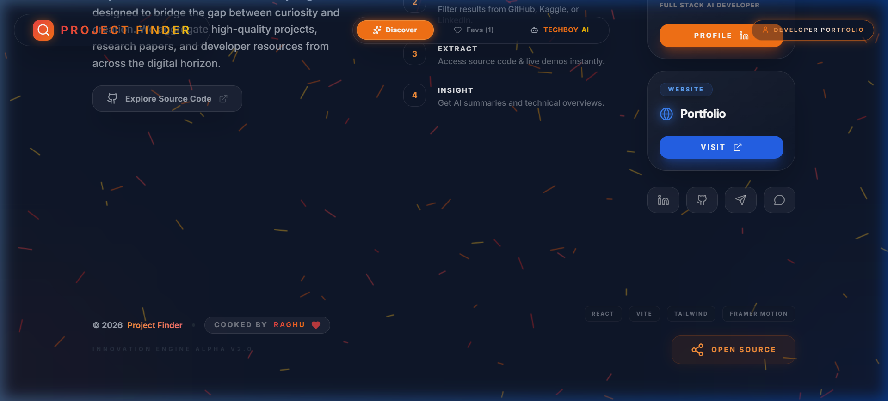

# Project Finder 🚀

<div align="center">
  
  
  
  
</div>
<br />

## 🌟 What This Project Is

**Project Finder** is a powerful research & discovery engine designed for developers, data scientists, and students. It provides a unified search experience across multiple platforms, allowing users to find projects, datasets, and models simultaneously across **GitHub**, **Hugging Face**, **Kaggle**, and **LinkedIn**. 

Whether you're looking for open-source libraries, machine learning models, trending architectures (like Auto-GPT or Stable Diffusion), or relevant datasets, Project Finder aggregates them efficiently.

---

## 🎯 How To Use

Using Project Finder is simple and requires no login or setup:

1. **Visit the Live Application**: Open the web application using the provided live link.
2. **Unified Search**: Enter a query (e.g., "Language Models", "Web Scraper", "Autonomous AI") into the central search bar.
3. **Smart Filtering**: Use the platform filters (GitHub, Hugging Face, Kaggle, LinkedIn) above the results to drill down specifically into Code, Models, or Datasets.
4. **Favorites (Your Library)**: Click the heart icon on any resource card to save it to your local visual library. Access it using the "Favorites" tab.
5. **Direct Navigation**: Click on verified repository links and grounding sources to go straight to the real platform.
6. **Publisher Portfolio**: Explore the creator's social footprint inside the Publisher profile section. 

---

## 💻 Live Link

No local installation setup steps required! Just click and explore:  
👉 **[Open Project Finder - Live Demo](https://chimataraghuram.github.io/PROJECT-FINDER/)**

*(Note: Confirm the exact link format if the deployment moves)*

---

## 📸 Screenshots Inside Application

Experience the new **Project Finder v2.0** high-fidelity interface:

### 1. Modern Unified Search & Animated Blueprint
The homepage now features an **Animated AI Blueprint** background with parallax scrolling, drift animations, and interactive click-pulses.
<p align="center">
  
</p>

### 2. Search Results & Action Protocol
Enhanced project cards now include a primary **Live Demo** button for instant interaction, alongside scroll-reveal animations.
<p align="center">
  
</p>

### 3. Rebranded TECHBOY AI Summary
The analytical engine has been completely rebranded with an orange "Elite" theme, integrating consolidated reference sources directly into the summary.
<p align="center">
  
</p>

### 4. Branded Signature Footer
Finalized the project with a custom personal signature: **COOKED BY RAGHU❤️**.
<p align="center">
  
</p>

---

## 🏗️ Structure Of This Project

The project is built around modern component-based architecture:

```text
PROJECT-FINDER/
├── public/                 # Public assets and videos (e.g., Intro video)
├── src/                    
│   ├── components/         # Reusable React components
│   │   ├── SearchBar.tsx   # Unified search bar UI
│   │   ├── ProjectCard.tsx # Layout for individual resources
│   │   ├── IntroVideo.tsx  # Initial loading application video
│   │   ├── Particles.tsx   # Interactive background effect
│   │   ├── Footer.tsx      # Bottom branding and links
│   │   └── ...
│   ├── services/           
│   │   └── apiService.ts   # Handling requests to GitHub, Hugging Face, Kaggle APIs
│   ├── types.ts            # Project-wide TypeScript definitions & interfaces
│   ├── App.tsx             # Main routing, state management, and layout wrapper
│   ├── index.css           # Global Tailwind utilities and custom CSS
│   └── index.tsx           # React app entry point
├── vite.config.ts          # Vite build configuration
├── tsconfig.json           # TypeScript configuration
├── package.json            # Project dependencies and details
└── README.md               # You are here!
```

---

## 🛠️ Technologies Used

This project heavily leverages the following technologies to offer a seamless, fast, and responsive user experience:

- **Library**: `React 19` ⚛️
- **Language**: `TypeScript` 📘
- **Build Tool**: `Vite` ⚡
- **Styling**: `Tailwind CSS` 🎨
- **Icons**: `Lucide React` ✨
- **Package Management**: `npm`

---

## 📄 License

**Copyright (c) 2026 Chimata Raghuram. All Rights Reserved.**

COMMERCIAL AND PERSONAL USE OF THIS SOFTWARE IS STRICTLY PROHIBITED WITHOUT THE PRIOR WRITTEN CONSENT OF THE OWNER (CHIMATA RAGHURAM).

Any unauthorized copying, modification, distribution, transmission, or other use of this material is strictly prohibited. The developer (Chimata Raghuram) reserves all rights to this software and its source code.
