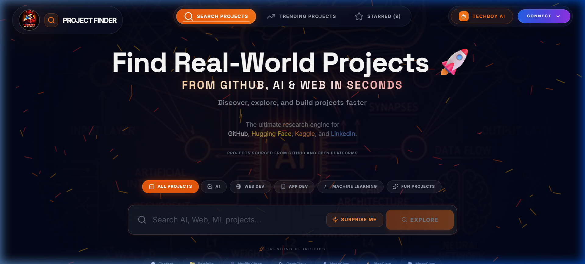
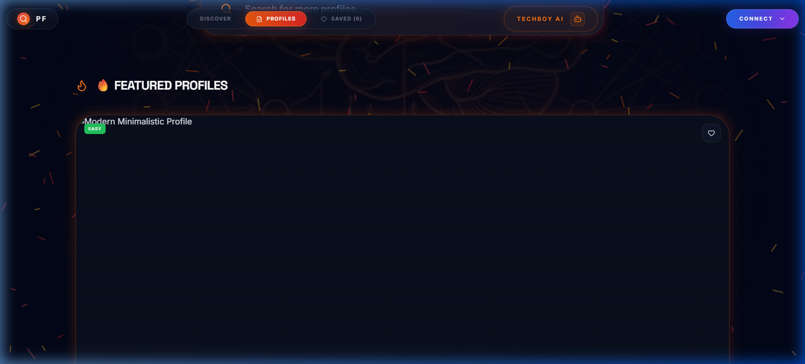
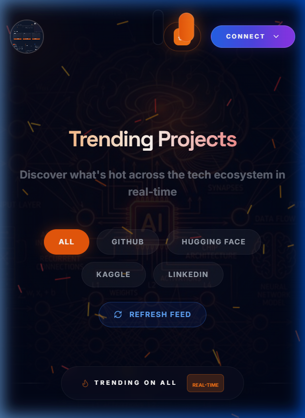
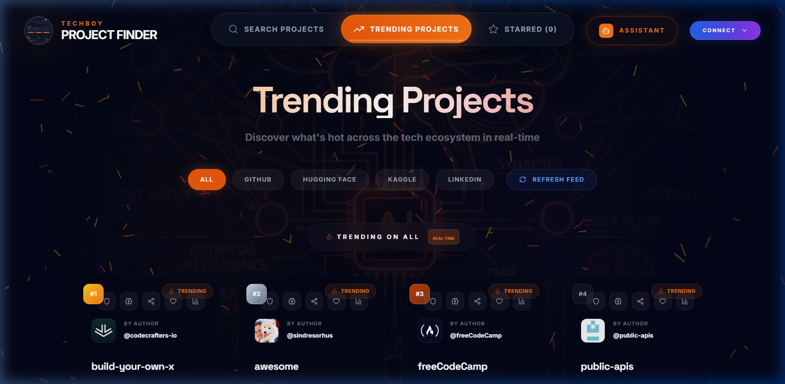

 

 
<h1 align="center">PROJECT FINDER</h1>

  <strong>🚀 Techboy Project Finder is a modern web application designed to help students and developers discover real-world open source projects from GitHub in seconds. It features real-time search and trending repositories powered by the GitHub API, enabling users to explore popular projects, view key details like stars and technologies, and find inspiration based on their interests. With a clean, responsive UI and smooth user experience, the platform makes learning, building, and contributing to open source faster, easier, and more engaging.</strong>

[🚀 Live Demo](https://chimataraghuram.github.io/PROJECT-FINDER/) • [💻 Explore Code](https://github.com/chimataraghuram/PROJECT-FINDER) • [🎨 Browse Profiles](https://chimataraghuram.github.io/PROJECT-FINDER/#profiles)

 

---

### 🚀 3-Island Floating Navbar
Experience our state-of-the-art header featuring three independent glassmorphic islands with dynamic scroll scaling.

  

 

### 🖥️ Desktop Discovery
A fluid, glassmorphic discovery engine with real-time API integrations and adaptive UI.

 

### 📱 Premium Mobile UI
Fully responsive design optimized for browsing on the go.

  

 

### ⚡ Trending & Discovery Engine
Watch the real-time trending dashboard featuring GitHub, Kaggle, Hugging Face, and more.

  

---

## 🔍 Features

| | Feature | Description |
|---|---|---|
| 🔍 | **Smart Search** | Search across GitHub, Hugging Face, Kaggle, and LinkedIn simultaneously. |
| ❤️ | **Save Favorites** | Securely save your favorite projects and profiles via Firebase integration. |
| 🎨 | **README Gallery** | A curated visual gallery of the world's best GitHub profile designs. |
| 📱 | **Responsive Design** | Pixel-perfect experience across mobile, tablet, and desktop. |
| 🚀 | **Dynamic 3-Island Nav**| Modular layout with independent glass islands and dynamic scroll scaling. |
| ⚡ | **Fast UI** | Blazing fast search and interactions powered by React and Framer Motion. |
| 🤖 | **Techboy Assistant** | Your personal AI guide to help you find the right tools and projects. |
| ⭐ | **Live Analytics** | Seamlessly extract exact source intelligence and repository metrics. |

---

## 🛠️ Tech Stack

- **Frontend**: [React.js](https://reactjs.org/), [TypeScript](https://www.typescriptlang.org/)
- **Styling**: [Tailwind CSS](https://tailwindcss.com/)
- **Animations**: [Framer Motion](https://www.framer.com/motion/)
- **Backend/Auth**: [Firebase](https://firebase.google.com/)
- **APIs**: GitHub Search API, Hugging Face API, Kaggle Dataset Discovery

---

## 🚀 Future Roadmap

- [ ] **AI Recommendations**: Personalized project suggestions based on your saved favorites.
- [ ] **Backend Integration**: Enhanced full-stack features with dedicated Express middleware.
- [ ] **Community Portals**: Share and review project discoveries with other developers.

---

## 👨‍💻 Author

**Raghu (Techboy)**

---

  Built with ❤️ for the Developer Community

